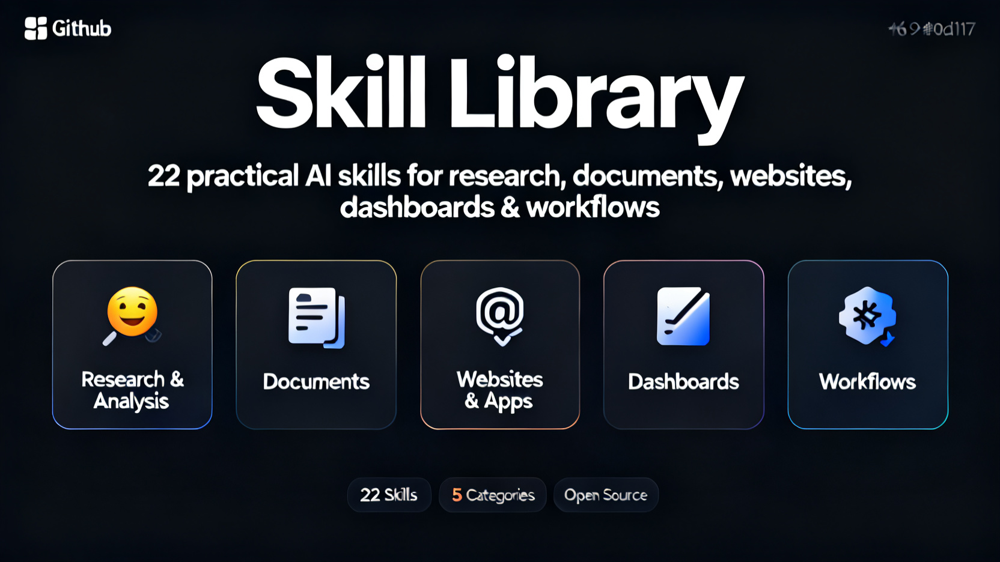

# Skill Library



[](https://github.com/qike7777/skill-library)
[](https://github.com/qike7777/skill-library)
[](https://claude.ai)
[](https://chat.openai.com)
[](https://github.com/qike7777/skill-library)

> 22 ready-to-use AI skills for research, documents, websites, dashboards, and workflow automation.  
> Works with Claude, ChatGPT, and any AI workspace that supports skill/instruction files.

---

## ⭐ Most Popular Skills

| Skill | What It Does |
|-------|-------------|
| [Competitor Analysis](skills/1-research-and-analysis/competitive-analysis/README.md) | Turn competitor names into a full intelligence report with SWOT, positioning map, and feature matrix |
| [Market Research Report](skills/1-research-and-analysis/market-research/README.md) | Go from a market or industry name to market size, trends, and opportunity analysis |
| [Financial Analysis](skills/1-research-and-analysis/financial-analyst/README.md) | Summarize financial documents and extract key signals, ratios, and scenarios |
| [PRD Writer](skills/5-workflow-and-operations/product-manager/README.md) | Generate structured PRDs from rough product ideas |
| [Landing Page Generator](skills/3-websites-and-apps/landing-page/README.md) | Build a conversion-focused landing page from a product description |
| [Email Sequence Builder](skills/5-workflow-and-operations/email-sequence/README.md) | Turn a target audience and goal into a ready-to-send email sequence |
| [PDF Toolkit](skills/2-documents/pdf-toolkit/README.md) | Extract, merge, fill, OCR, and compress PDF files — all local |
| [Meeting Notes to Action Items](skills/2-documents/meeting-summary/README.md) | Paste a transcript, get a TL;DR, decisions, and action items |

---

## 📚 All Skills by Category

### 🔍 Research & Analysis

Turn raw sources into structured insights and reports.

| Skill | One-liner |
|-------|-----------|
| [Competitor Analysis](skills/1-research-and-analysis/competitive-analysis/README.md) | Research 5–8 competitors → report + Excel matrix + SWOT + positioning map |
| [Financial Analysis](skills/1-research-and-analysis/financial-analyst/README.md) | Input financials → model + HTML dashboard + scenario planning |
| [Market Research Report](skills/1-research-and-analysis/market-research/README.md) | Input a market → size + trends + competitive landscape + opportunities |
| [Deep Research Report](skills/1-research-and-analysis/research-writing/README.md) | Input a topic → publication-quality report + HTML + citation xlsx |
| [User Research Synthesizer](skills/1-research-and-analysis/user-research/README.md) | Interviews + surveys → personas + journey maps + insight report |

---

### 📄 Documents

Turn messy input into clean, structured, ready-to-use documents.

| Skill | One-liner |
|-------|-----------|
| [Contract Drafter](skills/2-documents/contract-drafter/README.md) | Describe terms → draft a contract, NDA, or employment agreement |
| [Excel Assistant](skills/2-documents/excel-assistant/README.md) | Chat to create, edit, or batch-process Excel files |
| [Meeting Notes to Action Items](skills/2-documents/meeting-summary/README.md) | Paste transcript → TL;DR + decisions + action items + Word export |
| [PDF Toolkit](skills/2-documents/pdf-toolkit/README.md) | Merge, split, OCR, fill, watermark, compress PDFs — fully local |

---

### 🌐 Websites & Apps

Go from an idea to a deployed, production-ready site or app.

| Skill | One-liner |
|-------|-----------|
| [Launch a Blog](skills/3-websites-and-apps/blog-creation/README.md) | Next.js blog with content generation + SEO + Vercel deploy |
| [Build a Mobile App](skills/3-websites-and-apps/build-mobile-app/README.md) | Design system → full React Native / Flutter app + Expo preview |
| [Build a Web App](skills/3-websites-and-apps/build-web-app/README.md) | Design system → full-stack web app + code review + Vercel deploy |
| [Landing Page Generator](skills/3-websites-and-apps/landing-page/README.md) | Product description → conversion-focused landing page + SEO + form |
| [Portfolio Builder](skills/3-websites-and-apps/portfolio/README.md) | Brand identity + project showcase + animations → Vercel deploy |

---

### 📊 Data & Dashboards

Plug in a CSV, get a live HTML dashboard with insights.

| Skill | One-liner |
|-------|-----------|
| [Ad Performance Dashboard](skills/4-data-and-dashboards/ad-performance-report/README.md) | Ad CSV → CPA anomaly detection + WoW comparison + HTML dashboard |
| [Content Analytics Dashboard](skills/4-data-and-dashboards/content-analytics-report/README.md) | Content CSV → best post times + engagement analysis + HTML dashboard |
| [E-commerce Sales Dashboard](skills/4-data-and-dashboards/ecommerce-sales-dashboard/README.md) | Sales CSV → RFM segments + repurchase rate + regional map |
| [Product Analytics Dashboard](skills/4-data-and-dashboards/product-analytics-dashboard/README.md) | Product data → retention heatmap + funnel + anomaly alerts |

---

### ⚙️ Workflow & Operations

Streamline repeatable work — content, courses, strategy, and planning.

| Skill | One-liner |
|-------|-----------|
| [Course Designer](skills/5-workflow-and-operations/course-designer/README.md) | Topic → full course outline + lesson plans + quizzes + HTML course page |
| [Email Sequence Builder](skills/5-workflow-and-operations/email-sequence/README.md) | Target audience → subject lines + body copy + CTA + HTML preview |
| [PRD Writer](skills/5-workflow-and-operations/product-manager/README.md) | Feature description → PRD + user stories + roadmap + OKRs |
| [Social Content Planner](skills/5-workflow-and-operations/social-media-strategist/README.md) | Topic → multi-platform content + calendar + scripts + strategy report |

---

## 🚀 How to Use

Each skill has a `SKILL.md` with an install URL.

1. Open any skill's `README.md` and copy the **Skill URL**
2. Add it to your AI workspace (Claude, ChatGPT, or any instruction-based AI)
3. Describe your task or paste your source material
4. Get structured, ready-to-use output

Or download the `-skill.zip` from any skill folder and extract it directly into your workspace.

---

## 📁 Repository Structure

```
skill-library/
├── README.md
├── assets/
│   └── cover.png
└── skills/
    ├── 1-research-and-analysis/
    │   ├── competitive-analysis/   ← SKILL.md + README.md + .zip
    │   ├── financial-analyst/
    │   ├── market-research/
    │   ├── research-writing/
    │   └── user-research/
    ├── 2-documents/
    │   ├── contract-drafter/
    │   ├── excel-assistant/
    │   ├── meeting-summary/
    │   └── pdf-toolkit/
    ├── 3-websites-and-apps/
    │   ├── blog-creation/
    │   ├── build-mobile-app/
    │   ├── build-web-app/
    │   ├── landing-page/
    │   └── portfolio/
    ├── 4-data-and-dashboards/
    │   ├── ad-performance-report/
    │   ├── content-analytics-report/
    │   ├── ecommerce-sales-dashboard/
    │   └── product-analytics-dashboard/
    └── 5-workflow-and-operations/
        ├── course-designer/
        ├── email-sequence/
        ├── product-manager/
        └── social-media-strategist/
```

---

## 🤝 Contributing

Found a bug or want to improve a skill? Open an issue or submit a pull request.

---

*22 skills · 5 categories · Works with Claude, ChatGPT, and any AI workspace*
